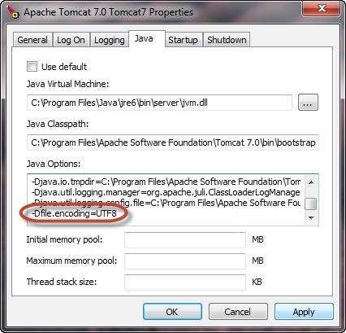

/*
Title:够快云库3.0 Java SDK 使用说明
Description:
Author: Brandon
Date: 2016/10/28
Robots: noindex,nofollow
*/

# 够快云库 3.0 Java SDK 使用说明

[](https://jitpack.io/#gokuai/yunku-sdk-java)

>够快云库 2.0 Java SDK 使用说明 [请查看这里][1]
>原 yunku-sdk-java 迁移到[这里][3]

* 版本：3.0
* 创建：2016-10-28

## 引用 
将`[yunku-java-sdk].jar`文件引用进项目，或者将`YunkuJavaSDK`做为依赖项目。

或者 Gradle:

```groovy
	allprojects {
		repositories {
			...
			maven { url 'https://jitpack.io' }
		}
	}
```

```groovy
	dependencies {
	        compile 'com.github.gokuai.yunku-sdk-java:YunkuJavaSDK:3.19'
	}
```
或者Maven：

```xml
	<repositories>
		<repository>
		    <id>jitpack.io</id>
		    <url>https://jitpack.io</url>
		</repository>
	</repositories>
```

```xml
	<dependency>
	    <groupId>com.github.gokuai.yunku-sdk-java</groupId>
	    <artifactId>YunkuJavaSDK</artifactId>
	    <version>3.19</version>
	</dependency>
```

## 初始化
要使用云库3.0的API，您需要先在 <a href="http://developer.gokuai.com/yk/tutorial#yk3" target="_blank">企业授权</a> 中获取 `client_id` 和 `client_secret`

## 参数使用

以下使用到的方法中，如果是string类型的非必要参数，如果是不传，则传`null`

## 修改API域名

要修改API域名，使用前请先调用HostConfig.changeConfig(oauthHost, apiHost)

## 设置代理

要设置代理，使用前请先调用HostConfig.setProxy(proxy)

## 企业库管理（EntLibManager.java）

### 构造方法
	new EntLibManager（ClientId, ClientSecret）
#### 参数 
| 参数 | 必须 | 类型 | 说明 |
| --- | --- | --- | --- |
| ClientId | 是 | string | 申请应用时分配的AppKey |
| ClientSecret | 是 | string | 申请应用时分配的AppSecret |

---

### 使用合作方 OutID 进行认证
	accessTokenWithThirdPartyOutId(String outId)
#### 参数
| 参数 | 必须 | 类型 | 说明 |
| --- | --- | --- | --- |
| outId | 是 | String | 企业在合作方系统中的唯一ID |

#### 返回结果
	{
    access_token: 企业token
    expires_in: token过期时间
	}

---

### 创建库
	create(String orgName, int orgCapacity, 
	            String storagePointName, String orgLogo) 
#### 参数 
| 参数 | 必须 | 类型 | 说明 |
| --- | --- | --- | --- |
| orgName | 是 | string | 库名称|
| orgCapacity | 否 | int | 库容量上限, 单位字节, 默认无上限|
| storagePointName | 否 | string | 库归属存储点名称, 默认使用够快存储|
| orgLogo | 否 | string | 库logo |

#### 数值参考
1T="1099511627776" 
1G＝“1073741824”；

#### 返回结果

    {
    	org_id:    
    	mount_id:
    }

| 字段 | 类型 | 说明 |
| --- | --- | --- |
| org_id | int | 库ID |
| mount_id | int | 库空间id |

---
### 获取库列表
	getLibList()
#### 参数
| 参数 | 必须 | 类型 | 说明 |
| --- | --- | --- | --- |
| memberId | 否 | int | 只返回该成员参与的库，传0则返回所有库 |
| type | 否 | int | 1返回非个人文件库, 2返回个人文件库, 默认0返回所有 |

#### 返回结果

    {
    'list':
        [
        	{
        		org_id : 库ID
        		org_name : 库名称
        		org_logo_url : 库图标url
        		size_org_total : 库空间总大小, 单位字节, -1表示空间不限制
        		size_org_use: 库已使用空间大小, 单位字节
        		mount_id: 库空间id
        	},
        	...
        ]
    }

---

### 修改库信息

	set(int orgId, String orgName, String orgCapacity, String orgLogo) 
#### 参数 
| 名称 | 必需 | 类型 | 说明 |
| --- | --- | --- | --- |
| orgId | 是 | int | 库id |
| orgName | 否 | string | 库名称 |
| orgCapacity | 否 | string | 库容量限制，单位B |
| orgLogo | 否 | string | 库logo |

#### 返回结果 
   正常返回 HTTP 200 

#### 数值参考
1T="1099511627776" 
1G＝“1073741824”；

---

### 获取库信息

	getInfo(int orgId)
#### 参数 
| 名称 | 必需 | 类型 | 说明 |
| --- | --- | --- | --- |
| orgId | 是 | int | 库id |


#### 返回结果 
	{
      info:
      {
        org_id : 库ID
        org_name : 库名称
        org_desc : 库描述
        org_logo_url : 库图标url
        size_org_total : 库空间总大小, 单位字节, -1表示空间不限制
        size_org_use: 库已使用空间大小, 单位字节
        mount_id: 库空间id
      }
	} 
   
---


### 获取库授权
	bind(int orgId, String title, String linkUrl)
#### 参数 
| 参数 | 必须 | 类型 | 说明 |
| --- | --- | --- | --- |
| orgId | 是 | int | 库ID |
| title | 否 | string | 标题(预留参数) |
| linkUrl | 否 | string | 链接(预留参数) |

#### 返回结果

	{
		org_client_id:
		org_client_secret:
	}

| 字段 | 类型 | 说明 |
| --- | --- | --- |
| org_client_id | string | 库授权client_id |
| org_client_secret | string | 库授权client_secret |

org\_client\_secret用于调用库文件相关API签名时的密钥

---


### 取消库授权
	unBind(String orgClientId) 
#### 参数 
| 参数 | 必须 | 类型 | 说明 |
| --- | --- | --- | --- |
| orgClientId | 是 | string | 库授权client_id |

#### 返回结果

	正常返回 HTTP 200

---

### 获取库成员列表
	getMembers(int start, int size, int orgId)
#### 参数 
| 参数 | 必须 | 类型 | 说明 |
| --- | --- | --- | --- |
| orgId | 是 | int | 库id |
| start | 否 | int | 分页开始位置，默认0 |
| size | 否 | int | 分页个数，默认20 |
#### 返回结果
	
	{
		list:
		[
			{
				"member_id": 成员id,
				"out_id": 成员外部id,
				"account": 外部账号,
				"member_name": 成员显示名,
				"member_email": 成员邮箱,
				"state": 成员状态。1：已接受，2：未接受,
			},
			...
		],
		count: 成员总数
	}

---

### 查询库成员信息
	getMember(int memberId)

#### 参数

| 参数 | 必须 | 类型 | 说明 |
| --- | --- | --- | --- |
| memberId | 否 | int | 成员id |
---		
*参数中的member\_id,out\_id和account必须传其中之一*

#### 返回结果

	{
      "member_id": 成员id,
      "member_name": 成员显示名,
      "member_email": 成员邮箱,
      "out_id": 外部系统唯一id,
      "account": 外部系统登录帐号,
      "state": 成员状态。1：已接受，2：未接受
	}

---


### 添加库成员
	addMembers(int orgId, int roleId, int[] memberIds) 
#### 参数 
| 参数 | 必须 | 类型 | 说明 |
| --- | --- | --- | --- |
| orgId | 是 | int | 库id |
| roleId | 是 | int | 角色id |
| memberIds | 是 | array | 需要添加的成员id数组 |
#### 返回结果
	
	正常返回 HTTP 200

---

### 修改库成员角色
	setMemberRole(int orgId, int roleId, int[] memberIds) 
#### 参数 
| 参数 | 必须 | 类型 | 说明 |
| --- | --- | --- | --- |
| orgId | 是 | int | 库id |
| roleId | 是 | int | 角色id |
| memberIds | 是 | array | 需要修改的成员id数组 |

#### 返回结果
	
	正常返回 HTTP 200

---
### 删除库成员
	delMember(int orgId, int[] memberIds)
#### 参数 
| 参数 | 必须 | 类型 | 说明 |
| --- | --- | --- | --- |
| orgId | 是 | int | 库id |
| memberIds | 是 | array | 成员id数组|
#### 返回结果
	
	正常返回 HTTP 200

---
### 获取库部门列表
	getGroups(int orgId)
#### 参数 
| 参数 | 必须 | 类型 | 说明 |
| --- | --- | --- | --- |
| orgId | 是 | int | 库id |
#### 返回结果
	{
		{
			"id": 部门id
			"name": 部门名称
			"role_id": 部门角色id
		},
		...
	}

---
### 库上添加部门
	addGroup(int orgId, int groupId, int roleId)
#### 参数 
| 参数 | 必须 | 类型 | 说明 |
| --- | --- | --- | --- |
| orgId | 是 | int | 库id |
| groupId | 是 | int | 部门id|
| roleId | 否 | int | 角色id |
#### 返回结果
	
	正常返回 HTTP 200

---
### 删除库上的部门
	delGroup(int orgId, int groupId)
#### 参数 
 参数 | 必须 | 类型 | 说明 |
| --- | --- | --- | --- |
| orgId | 是 | int | 库id |
| groupId | 是 | int | 部门id |
#### 返回结果
	
	正常返回 HTTP 200

---


### 修改库上部门的角色
	setGroupRole(int orgId, int groupId, int roleId)
#### 参数 
| 参数 | 必须 | 类型 | 说明 |
| --- | --- | --- | --- |
| orgId | 是 | int | 库id |
| groupId | 是 | int | 部门id |
| roleId | 否 | int | 角色id |
#### 返回结果
	
	正常返回 HTTP 200

---

### 删除库
	destroy(String orgClientId)
#### 参数 
| 参数 | 必须 | 类型 | 说明 |
| orgClientId | 是 | string | 库授权client_id|
#### 返回结果
	
	正常返回 HTTP 200

---


## 企业管理（EntManager.java）

### 构造方法

	new EntManager（ String ClientId, String ClientSecret）
	
#### 参数 
| 参数 | 必须 | 类型 | 说明 |
| --- | --- | --- | --- |
| ClientId | 是 | string | 申请应用时分配的AppKey |
| ClientSecret | 是 | string | 申请应用时分配的AppSecret |

---

### 使用合作方 OutID 进行认证
	accessTokenWithThirdPartyOutId(String outId)
#### 参数
| 参数 | 必须 | 类型 | 说明 |
| --- | --- | --- | --- |
| outId | 是 | String | 企业在合作方系统中的唯一ID |

#### 返回结果
	{
    access_token: 企业token
    expires_in: token过期时间
	}

---


### 获取角色
	getRoles() 
#### 参数
（无） 
#### 返回结果
	[
		{
			"id": 角色id,
			"name": 角色名称,
			},
		...
	]

---

### 获取成员列表
	getMembers(int start, int size)
#### 参数 
| 参数 | 必须 | 类型 | 说明 |
| --- | --- | --- | --- |
| start | 否 | int | 记录开始位置, 默认0 |
| size | 否 | int | 返回条数, 默认20 |
#### 返回结果
	{
		list:
		[
			{
				"member_id": 成员id,
				"out_id": 成员外部id,
				"account": 外部账号,
				"member_name": 成员显示名,
				"member_email": 成员邮箱,
				"state": 成员状态。1：已接受，2：未接受,
			},
			...
		],
		count: 成员总数
	}

---

### 根据成员Id查询企业成员信息
	getMemberById(int memberId)

#### 参数 
	
| 参数 | 必须 | 类型 | 说明 |
| --- | --- | --- | --- |
| memberId | 是 | int | 成员id |


#### 返回结果

	{
      "member_id": 成员id,
      "member_name": 成员显示名,
      "member_email": 成员邮箱,
      "out_id": 外部系统唯一id,
      "account": 外部系统登录帐号,
      "state": 成员状态。1：已接受，2：未接受
	}

---

### 根据外部系统唯一id查询企业成员信息
	getMemberByOutId(String outId)

#### 参数 
	
| 参数 | 必须 | 类型 | 说明 |
| --- | --- | --- | --- |
| outId | 是 | String | 外部系统唯一id|


#### 返回结果

	{
      "member_id": 成员id,
      "member_name": 成员显示名,
      "member_email": 成员邮箱,
      "out_id": 外部系统唯一id,
      "account": 外部系统登录帐号,
      "state": 成员状态。1：已接受，2：未接受
	}

---
### 根据外部系统登录帐号查询企业成员信息
	String getMemberByAccount(String account)

#### 参数 
	
| 参数 | 必须 | 类型 | 说明 |
| --- | --- | --- | --- |
| account | 是 | String | 外部系统登录帐号 |


#### 返回结果

	{
      "member_id": 成员id,
      "member_name": 成员显示名,
      "member_email": 成员邮箱,
      "out_id": 外部系统唯一id,
      "account": 外部系统登录帐号,
      "state": 成员状态。1：已接受，2：未接受
	}

---


### 获取部门
	getGroups() 
#### 参数 
（无）
#### 返回结果
	{
		"list":
		[
			{
				"id": 部门id,
				"name": 部门名称,
				"out_id": 外部唯一id,
				"parent_id": 上级部门id, 0为顶级部门
			}
		]
	}	

---
### 部门成员列表
	getGroupMembers(int groupId, int start, int size, boolean showChild) 
#### 参数 
| 参数 | 必须 | 类型 | 说明 |
| --- | --- | --- | --- |
| groupId | 是 | int | 部门id |
| start | 是 | int | 记录开始位置 |
| size | 是 | int | 返回条数 |
| showChild | 是 | boolean | [0,1] 是否显示子部门内的成员 |
#### 返回结果
	
	
	{
		list:
		[
			{
				"member_id": 成员id,
				"out_id": 成员外部id,
				"account": 外部账号,
				"member_name": 成员显示名,
				"member_email": 成员邮箱,
				"state": 成员状态。1：已接受，2：未接受,
			},
			...
		],
		count: 成员总数
	}

---
### 根据成员id获取成员个人库外链
	getMemberFileLink(int memberId, boolean fileOnly)
#### 参数 
| 参数 | 必须 | 类型 | 说明 |
| --- | --- | --- | --- |
| memberId | 是 | int | 成员id |
| fileOnly | 是 | boolean | 是否只返回文件, 1只返回文件 |
#### 返回结果
	[
		{
		    "filename": 文件名或文件夹名,
		    "filesize": 文件大小,
    		"link": 链接地址,
    		"deadline": 到期时间戳 -1表示永久有效,
    		"password": 是否加密, 1加密, 0无
    	},
    	...
	]

---

### 添加或修改同步成员
	addSyncMember(String outId,String memberName,String account,String memberEmail,String memberPhone,String password)
#### 参数 
| 参数 | 必须 | 类型 | 说明 |
| --- | --- | --- | --- |
| outId | 是 | string | 成员在外部系统的唯一id |
| memberName | 是 | string | 显示名称 |
| account | 是 | string | 成员在外部系统的登录帐号 |
| memberEmail | 否 | string | 邮箱 |
| memberPhone | 否 | string | 联系电话 |
| password | 否 | string | 如果需要由够快验证帐号密码,密码为必须参数 |

#### 返回结果

    HTTP 200

---

### 删除同步成员
	delSyncMember(String[] members)
#### 参数 
| 参数 | 必须 | 类型 | 说明 |
| --- | --- | --- | --- |
| members | 是 | array | 成员在外部系统的唯一id数组|

#### 返回结果

    HTTP 200

---

### 添加或修改同步部门
	addSyncGroup(String outId,String name,String parentOutId)
#### 参数 
| 参数 | 必须 | 类型 | 说明 |
| --- | --- | --- | --- |
| outId | 是 | string | 部门在外部系统的唯一id |
| name | 是 | string | 显示名称 |
| parentOutId | 否 | string | 如果部门在另一个部门的下级, 需要指定上级部门唯一id, 不传表示在顶层, 修改部门时该字段无效 |

#### 返回结果

    HTTP 200

---
### 删除同步部门
	delSyncGroup(String[]groups)
#### 参数 
| 参数 | 必须 | 类型 | 说明 |
| --- | --- | --- | --- |
| groups | 是 | string | 部门在外部系统的唯一id数组|

#### 返回结果

    HTTP 200
---
### 添加同步部门的成员
	addSyncGroupMember(String groupOutId,String[] members)
#### 参数 
| 参数 | 必须 | 类型 | 说明 |
| --- | --- | --- | --- |
| groupOutId | 否 | string | 外部部门的唯一id, 不传表示顶层 |
| members | 是 | array | 成员在外部系统的唯一id数组 |
#### 返回结果

    HTTP 200
---
### 删除同步部门的成员
	delSyncGroupMember(String groupOutId, String[] members)
#### 参数 
| 参数 | 必须 | 类型 | 说明 |
| --- | --- | --- | --- |
| groupOutId | 否 | string | 外部部门的唯一id, 不传表示顶层 |
| members | 是 | string | 成员在外部系统的唯一id数组 |
#### 返回结果

    HTTP 200
---
### 删除成员的所属部门
	delSyncMemberGroup(String[] members)
#### 参数
| 参数 | 必须 | 类型 | 说明 |
| --- | --- | --- | --- |
| members | 是 | string | 成员在外部系统的唯一id数组 |
#### 返回结果

    HTTP 200
---  
### 添加管理员
	addSyncAdmin(String outId, String memberEmail, boolean isSuperAdmin)
#### 参数
| 参数 | 必须 | 类型 | 说明 |
| --- | --- | --- | --- |
| outId | 是 | string | 成员在外部系统的唯一id数组 |
| memberEmail | 是 | string | 成员邮箱 |
| isSuperAdmin | 是 | boolean | 是否为超级管理员，否表示管理员 |
#### 返回结果

    HTTP 200
---


## 企业文件管理（EntFileManager.java）

`orgClientId`和`orgClientSecret`需要通过`EntLibManager`.`bind`方法获取

### 构造方法

	new EntFileManager(String orgClientId,String orgClientSecret);
	
#### 参数 
| 参数 | 必须 | 类型 | 说明 |
| --- | --- | --- | --- |
| orgClientId | 是 | string | 库授权client_id  |
| orgClientSecret | 是 | string | 库授权client_secret  |

---
### 获取文件列表
	getFileList( int start, String fullPath)
#### 参数 
| 名称 | 必需 | 类型 | 说明 |
| --- | --- | --- | --- |
| start | 是 | int | 开始位置(每次返回100条数据) |
| fullPath | 是 | string | 文件的路径 |

#### 返回结果
	{
		count:
		list:
		[
			{
				hash:
				dir:
				fullpath:
				filename:
				filehash:
				filesize:
				create_member_name:
				create_dateline:
				last_member_name:
				last_dateline:
			},
			...
		]
	}
	
| 字段 | 类型 | 说明 |
| --- | --- | --- |
| count | int | 文件总数 |
| list | Array | 格式见下 |
| 字段 | 类型 | 说明 |
| --- | --- | --- |
| hash | string | 文件唯一标识 |
| dir | int | 是否文件夹, 1是, 0否 |
| fullpath | string | 文件路径 |
| filename | string | 文件名称 |
| filehash | string | 文件内容hash, 如果是文件夹, 则为空 |
| filesize | long | 文件大小, 如果是文件夹, 则为0 |
| create_member_name | string | 文件创建人名称 |
| create_dateline | int | 文件创建时间戳 |
| last_member_name | string | 文件最后修改人名称 |
| last_dateline | int | 文件最后修改时间戳 |

---
### 获取更新列表
	getUpdateList( boolean isCompare, long fetchDateline)
#### 参数 
| 名称 | 必需 | 类型 | 说明 |
| --- | --- | --- | --- |
| mode | 否 | string | 更新模式, 可不传, 当需要返回已删除的文件时使用compare |
| fetchDateline | 是 | int | 13位时间戳, 获取该时间后的数据, 第一次获取用0 |
#### 返回结果
| 字段 | 类型 | 说明 |
| --- | --- | --- |
| fetch_dateline | int | 当前返回数据的最大时间戳（13位精确到毫秒） |
| list | Array | 格式见下 |

| 字段 | 类型 | 说明 |
| --- | --- | --- |
| cmd | int | 当mode=compare 时才会返回cmd字段, 0表示删除, 1表示未删除 |
| hash | string | 文件唯一标识 |
| dir | int | 是否文件夹, 1是, 0否 |
| fullpath | string | 文件路径 |
| filename | string | 文件名称 |
| filehash | string | 文件内容hash, 如果是文件夹, 则为空 |
| filesize | long | 文件大小, 如果是文件夹, 则为0 |
| create_member_name | string | 文件创建人名称 |
| create_dateline | int | 文件创建时间戳 |
| last_member_name | string | 文件最后修改人名称 |
| last_dateline | int | 文件最后修改时间戳 |

---

### 文件更新数量
	getUpdateCounts( long beginDateline, long endDateline, boolean showDelete)
	
#### 参数 
| 名称 | 必需 | 类型 | 说明 |
| --- | --- | --- | --- |
| beginDateline | 是 | long | 13位时间戳, 开始时间 |
| endDateline | 是 | long | 13位时间戳, 结束时间 |
| showDelete | 是 | boolean |是否返回删除文件 |

#### 返回结果

	{
		count: 更新数量
	}
---

### 获取文件信息
	getFileInfo( String fullPath,NetType net,boolean getAttribute)
#### 参数
| 名称 | 必需 | 类型 | 说明 |
| --- | --- | --- | --- |
| fullPath | 是 | string | 文件路径 |
| net | 是 | NetType | DEFAULT,返回公网下载地址；IN，返回内网下载地址 |
| getAttribute | 否 | boolean | 是否获取额外属性(子文件数量、大小，子文件夹数量) |

#### 返回结果

	{
		hash:
		dir:
		fullpath:
		filename:
		filesize:
		create_member_name:
		create_dateline:
		last_member_name:
		last_dateline:
		uri:
		preview:
		thumbnail:
	}

| 字段 | 类型 | 说明 |
| --- | --- | --- |
| hash | string | 文件唯一标识 |
| dir | int | 是否文件夹 |
| fullpath | string | 文件路径 |
| filename | string | 文件名称 |
| filehash | string | 文件内容hash |
| filesize | long | 文件大小 |
| create_member_name | string | 文件创建人 |
| create_dateline | int | 文件创建时间戳(10位精确到秒)|
| last_member_name | string | 文件最后修改人 |
| last_dateline | int | 文件最后修改时间戳(10位精确到秒) |
| uri | string | 文件下载地址 |
| preview | string | 文件预览地址 |
| thumbnail | string | 文件缩略图地址 |

---
### 通过文件唯一标识获取下载地址
     getDownloadUrlByHash(String hash, final boolean isOpen, NetType net)
#### 参数

| 名称 | 必需 | 类型 | 说明 |
| --- | --- | --- | --- |
| hash | 是 | string | 文件唯一标识 |
| isOpen | 是 | boolean | 是否返回能直接在浏览器中打开的文件地址 |
| net | 是 | NetType | DEFAULT,返回公网下载地址；IN，返回内网下载地址 |
### 返回结果

     	{
     		"urls": [文件下载地址数组(可能有多个下载地址)]
     	}

---
### 通过文件路径获取下载地址
    getDownloadUrlByFullPath(String fullPath, final boolean isOpen, NetType net)
#### 参数

| 名称 | 必需 | 类型 | 说明 |
| --- | --- | --- | --- |
| fullPath | 是 | string | 文件路径 |
| isOpen | 是 | boolean | 是否返回能直接在浏览器中打开的文件地址 |
| net | 是 | NetType | DEFAULT,返回公网下载地址；IN，返回内网下载地址 |
### 返回结果

	{
		"urls": [文件下载地址数组(可能有多个下载地址)]
	}

---
### 创建文件夹
	createFolder( String fullPath,String opName)
#### 参数 

| 参数 | 必须 | 类型 | 说明 |
|------|------|------|------|
| fullPath | 是 |string| 文件夹路径 |
| opName | 否 | string | 操作人名称 |
#### 返回结果

| 字段 | 类型 | 说明 |
|------|------|------|
| hash | string | 文件唯一标识 |
| fullpath | string | 文件夹的路径 |

---
### 通过文件流上传（50M以内文件，覆盖同名文件）
	createFile( String fullPath, String opName, FileInputStream stream)
### 通过文件流上传（50M以内文件）
	createFile( String fullPath, String opName, FileInputStream stream, boolean overWrite)
#### 参数 
| 参数 | 必须 | 类型 | 说明 |
|------|------|------|------|
| fullPath | 是 | string | 文件路径 |
| opName | 否 | string | 操作人名称|
| stream | 是 | stream | 文件流 |
| overWrite| 否 | boolean| 是否覆盖同名文件, true覆盖(默认) false不覆盖,文件名后增加数字标识|


#### 返回结果
| 字段 | 类型 | 说明 |
|------|------|------|
| hash | string | 文件唯一标识 |
| fullpath | string | 文件路径 |
| filehash | string | 文件内容hash |
| filesize | long | 文件大小 |

---
### 通过本地路径上传（50M以内文件，覆盖同名文件）
	createFile( String fullPath, String opName, String localPath)
### 通过本地路径上传（50M以内文件）
	createFile( String fullPath, String opName, String localPath , boolean overWrite)
#### 参数 
| 参数 | 必须 | 类型 | 说明 |
|------|------|------|------|
| fullPath | 是 | string | 文件路径 |
| opName | 否 | string | 操作人名称|
| localPath | 是 | string | 本地文件路径 |
| fileName | 是 | string | 文件名 |
| overWrite| 否 | boolean| 是否覆盖同名文件, true覆盖(默认) false不覆盖,文件名后增加数字标识|
#### 返回结果
| 字段 | 类型 | 说明 |
|------|------|------|
| hash | string | 文件唯一标识 |
| fullpath | string | 文件路径 |
| filehash | string | 文件内容hash |
| filesize | long | 文件大小 |

---

### 文件分块上传 (覆盖同名文件）
	uploadByBlock( String fullPath, String opName,
	 int opId, String localFilePath, int rangSize, UploadCallBack callBack)
### 文件分块上传
	uploadByBlock( String fullPath, String opName,
	 int opId, String localFilePath, boolean overWrite, int rangSize, UploadCallBack callBack)
#### 参数 
| 参数 | 必须 | 类型 | 说明 |	
|------|------|------|------|
| fullpath | 是 | string | 文件路径 |
| opName | 否 | string |  创建人名称, 如果指定了opId, 就不需要opName， |
| opId | 否 | int | 创建人id, 个人库默认是库拥有人id, 如果创建人不是云库用户, 可以用op_name代替,|
| localFilePath | 是 | string | 文件本地路径 |
| overWrite | 否 | boolean | 是否覆盖同名文件, true覆盖(默认) false不覆盖,文件名后增加数字标识 |
| callBack | 否 | UploadCallBack | 文件上传回调 |

---

### 数据流分块上传 (覆盖同名文件）
	uploadByBlock( String fullPath, String opName,
	 int opId, InputStream inputStream, int rangSize, UploadCallBack callBack)
### 数据流分块上传
	uploadByBlock( String fullPath, String opName,
	 int opId, InputStream inputStream, boolean overWrite, int rangSize, UploadCallBack callBack)
#### 参数 
| 参数 | 必须 | 类型 | 说明 |	
|------|------|------|------|
| fullpath | 是 | string | 文件路径 |
| opName | 否 | string |  创建人名称, 如果指定了opId, 就不需要opName |
| opId | 否 | int | 创建人id, 个人库默认是库拥有人id, 如果创建人不是云库用户, 可以用op_name代替,|
| inputStream | 是 | InputStream | 流数据 |
| overWrite | 否 | boolean | 是否覆盖同名文件, true覆盖(默认) false不覆盖,文件名后增加数字标识 |
| callBack | 否 | UploadCallBack | 文件上传回调 |

---  
### 复制文件
	copy(String originFullPath, String targetFullPath, String opName)
#### 参数 

| 参数 | 必需 | 类型 | 说明 |
|------|------|------|------|
| originFullPath | 是 | string | 源文件路径 |
| targetFullPath | 是 | string | 目标文件路径(含文件名称) |
| opName | 否 | string | 操作人名称 |

---  
	
### 删除文件
	del( String fullPaths, String opName)
#### 参数 
| 参数 | 必需 | 类型 | 说明 |
|------|------|------|------|
| fullPaths| 是 |string| 文件路径，如果是多个文件用“｜”符号隔开 |
| opName | 否 | string | 操作人名称|
#### 返回结果
	正常返回 HTTP 200
---
### 回收站
	recycle(int start, int size)
#### 参数 
| 参数 | 必需 | 类型 | 说明 |
|------|------|------|------|
| start | 否 | int | 开始位置,默认0 |
| size | 否 | int | 返回条数,默认100 |
#### 返回结果
	正常返回 HTTP 200
	
---
### 恢复删除文件
	recover(String fullpaths, String opName)
#### 参数 
| 参数 | 必需 | 类型 | 说明 |
|------|------|------|------|
| fullpaths | 是 | string | 要恢复文件的路径 |
| opName | 否 | string | 操作人名称 |
#### 返回结果
	正常返回 HTTP 200
	
---

### 彻底删除文件
	delCompletely(String[] fullpaths, String opName)
#### 参数 
| 参数 | 必需 | 类型 | 说明 |
|------|------|------|------|
| fullpaths | 是 | string[] | 要彻底删除文件的路径 |
| opName | 否 | string | 操作人名称 |
#### 返回结果
	正常返回 HTTP 200
	
---

### 移动文件
	move( String fullPath, String destFullPath, String opName)
#### 参数 

| 参数 | 必需 | 类型 | 说明 |
|------|------|------|------|
| fullPath | 是 | string | 要移动文件的路径 |
| destFullPath | 是 | string | 移动后的路径 |
| opName | 否 | string | 操作人名称|

#### 返回结果
	正常返回 HTTP 200
---

### 获取文件历史
	history(String fullPath, int start, int size)
#### 参数 

| 参数 | 必需 | 类型 | 说明 |
|------|------|------|------|
| fullPath | 是 | string | 要移动文件的路径 |
| start | 否 | int | 开始位置,默认0 |
| size | 否 | int | 返回条数,默认20 |

#### 返回结果
```	
{
  count:
  list:[
      {
            hid:
            act:
            act_name:
            dir:
            hash:
            fullpath:
            filehash:
            filesize:
            member_id:
            member_name:
            dateline:
            property:
      }
      ...
    ]
}
```

---

### 获取文件链接
	link( String fullPath, int deadline, AuthType authType, String password)
#### 参数 
| 参数 | 必需 | 类型 | 说明 |
|------|------|------|------|
| fullPath | 是 | string | 文件路径 |	
| deadline | 否 | int | 10位链接失效的时间戳 ，永久传－1 |
| authtype | 是 | enum | 文件访问权限DEFAULT默认为预览，PREVIEW：预览，DOWNLOAD：下载、预览，UPLOAD：上传、下载、预览｜	
| password | 否 | string | 密码，不过不设置密码，传null |


#### 返回结果

---

### 文件预览地址
	previewUrl(String fullPath, final boolean showWaterMark, String memberName)
#### 参数 
| 名称 | 必需 | 类型 | 说明 |
| --- | --- | --- | --- |
| fullPath | 是 | string | 消息标题 |
| showWaterMark | 是 | boolean | 是否显示水印 |
| memberName | 否 | string | 在水印中显示的文档查看人姓名 |

#### 返回结果
	{
    	"url" : 文档预览地址(10分钟有效)
	}
	
---

### 获取文件夹权限
	getPermission(String fullPath, int memberId)
#### 参数 
| 名称 | 必需 | 类型 | 说明 |
| --- | --- | --- | --- |
| fullPath | 是 | string | 消息标题 |
| memberId | 是 | int | 用户ID |

#### 返回结果
	{
    	["file_read","file_preview","file_write","file_delete"]
	}
	
---

### 修改文件夹权限
	setPermission(String fullPath, FilePermissions... permissions)
#### 参数 
| 名称 | 必需 | 类型 | 说明 |
| --- | --- | --- | --- |
| fullPath | 是 | string | 消息标题 |
| permissions | 是 | FilePermissions | 权限,如 {member_id:["file_read","file_preview","file_write","file_delete"],...} |

#### 返回结果
	正常返回 HTTP 200 
	
---

### 添加标签
	addTag(String fullPath, String[] tags)
#### 参数 
| 名称 | 必需 | 类型 | 说明 |
| --- | --- | --- | --- |
| fullPath | 是 | string | 文件的路径 |
| tags | 是 | string | 标签 |
#### 返回结果
	正常返回 HTTP 200 
---

### 删除标签
	delTag(String fullPath, String[] tags)
#### 参数 
| 名称 | 必需 | 类型 | 说明 |
| --- | --- | --- | --- |
| fullPath | 是 | string | 文件的路径 |
| tags | 是 | string | 标签 |
#### 返回结果
	正常返回 HTTP 200 
---

### 发送消息
	sendmsg( String title,String text, 
					String image, String linkUrl, String opName) 
#### 参数 
| 名称 | 必需 | 类型 | 说明 |
| --- | --- | --- | --- |
| title | 是 | string | 消息标题 |
| text | 是 | string | 消息正文 |
| image | 否 | string | 图片url |
| linkUrl | 否 | string | 链接 |
| opName | 否 | string | 操作人名称 |
#### 返回结果
	正常返回 HTTP 200 
---

### 获取当前库所有外链
	links( boolean fileOnly)
#### 参数 
| 名称 | 必需 | 类型 | 说明 |
| --- | --- | --- | --- |
| fileOnly | 是 | boolean | 是否只返回文件, 1只返回文件 |
#### 返回结果
	[
		{
		    "filename": 文件名或文件夹名,
		    "filesize": 文件大小,
    		"link": 文件外链地址,
    		"deadline": 到期时间戳 -1表示永久有效,
    		"password": 是否加密, 1加密, 0无
    	},
    	...
	]

---

### 通过链接上传文件（覆盖同名文件）
	createFileByUrl(String fullpath,int opId,String opName,String url)
### 通过链接上传文件
	createFileByUrl(String fullpath,int opId,String opName,boolean overwrite,String url)
#### 参数 
| 名称 | 必需 | 类型 | 说明 |
| --- | --- | --- | --- |
| fullpath | 是 | string | 文件路径 |
| opId | 否 | int | 创建人id, 个人库默认是库拥有人id, 如果创建人不是云库用户, 可以用op_name代替|
| opName | 否 | string | 创建人名称, 如果指定了opId, 就不需要opName|
| overWrite | 否 | boolean | 是否覆盖同名文件, true覆盖(默认) false不覆盖,文件名后增加数字标识|
| url | 是 | string | 需要服务端获取的文件url|

#### 返回结果
	正常返回 HTTP 200 

---

### WEB直接上传文件
	getUploadServers()

#### 参数 

(无)

#### 返回结果
	{
       "upload":
       [
          上传服务器地址 如:http://upload.domain.com,
         ...
       ]
	}

---

### 文件搜索
	search(String keyWords, String path, int start, int size, ScopeType... scopes)

#### 参数 
| 名称 | 必需 | 类型 | 说明 |
| --- | --- | --- | --- |
| keyWords | 是 | string | 搜索关键字 |
| path | 是 | string | 需要搜索的文件夹|
| start | 是 | int | 开始位置|
| size | 是 | int | 返回条数|
| scopes | 是 | ScopeType... | 范围，FILENAME-文件名、TAG-标签、CONTENT-全文|

#### 返回结果
	{
		count:
		list:
		[
			{
				hash:
				dir:
				fullpath:
				filename:
				filehash:
				filesize:
				create_member_name:
				create_dateline:
				last_member_name:
				last_dateline:
			},
			...
		]
	}
---

## 企业合作API（ThirdPartyManager.java）
### 构造方法
	new ThirdPartyManager(String clientId, String clientSecret, String outId)
### 参数
| 名称 | 必需 | 类型 | 说明 |
| --- | --- | --- | --- |
| clientId | 是 | string | 够快分配的client_id |
| clientSecret | 是 | string | 够快分配的clientSecret |
| outId | 是 | string | 企业在合作方系统中的唯一ID |

### 开通企业
	createEnt(String entName, String contactName,
				String contactMobile, String contactEmail, String contactAddress)

#### 参数
| 名称 | 必需 | 类型 | 说明 |
| --- | --- | --- | --- |
| entName | 是 | string | 	企业名称 |
| contactName | 是 | string | 企业联系人姓名 |
| contactMobile | 否 | string | 企业联系电话 |
| contactEmail | 否 | string | 企业联系邮箱 |
| contactAddress  | 否 | string | 企业联系地址 |

### 扩展参数
	createEnt(HashMap<String, String> map,String entName, String contactName,
			String contactMobile, String contactEmail, String contactAddress)
#### 参数
| 名称 | 必需 | 类型 | 说明 |
| --- | --- | --- | --- |
| map | 是 | hashMap| 用于传递一些特殊用途的企业初始数据, 参数前缀为__setting _ , 例如: 	__ setting _ site _ url |
| entName | 是 | string | 	企业名称 |
| contactName | 是 | string | 企业联系人姓名 |
| contactMobile | 否 | string | 企业联系电话 |
| contactEmail | 否 | string | 企业联系邮箱 |
| contactAddress  | 否 | string | 企业联系地址 |
#### 返回结果
	正常返回 HTTP 200

### 获取企业信息
	getEntInfo()
#### 参数

(无)

#### 返回结果
	{
	  "id": 企业ID,
	  "name": 企业名称,
	  "trial": 是否试用, 1表示试用, 0表示正式开通,
	  "end_dateline": 到期时间, unix时间戳,
	  "member_limit": 成员数量上限,
	  "member_count": 成员数量,
	  "space": 空间上限, 单位字节,
	  "size": 已使用空间, 单位字节
	}

### 购买
	orderSubscribe(int memberCount, int space, int month)

#### 参数
| 名称 | 必需 | 类型 | 说明 |
| --- | --- | --- | --- |
| memberCount | 是 | int | 人数（不限是-1） |
| space | 是 | int | 空间(G) |
| month | 是 | int | 购买的月数 |
#### 返回结果
	正常返回 HTTP 200

### 升级
	orderUpgrade(int memberCount, int space)
#### 参数
| 名称 | 必需 | 类型 | 说明 |
| --- | --- | --- | --- |
| memberCount | 是 | int | 人数（不限是-1） |
| space | 是 | int | 空间(G) |
#### 返回结果
	正常返回 HTTP 200

### 续费
	orderRenew(int month)
#### 参数
| 名称 | 必需 | 类型 | 说明 |
| --- | --- | --- | --- |
| month | 是 | int | 购买的月数 |
#### 返回结果
	正常返回 HTTP 200

### 退订
	orderUnsubscribe()
#### 参数

(无)

#### 返回结果
	正常返回 HTTP 200

### 获取企业token
	getEntToken()

#### 参数

(无)

#### 返回结果
	{
    	access_token: 企业token
    	expires_in: token过期时间
	}

### 获取单点登录地址
	getSsoUrl(String ticket)
#### 参数
| 名称 | 必需 | 类型 | 说明 |
| --- | --- | --- | --- |
| ticket | 是 | string | 	单点登录需要验证的票据 |

#### 返回结果
	{
    	url: 单点登录URL
	}

### [单点登录流程][2]

---

## 常见问题
### 编码问题
#### 现象
* Windows 运行环境，中文文件名参数可能会导致，返回签名的报错信息。

#### 解决方法
**方案1:** 更换运行环境，使用 Linux 服务器  

**方案2:** 如果是命令行执行 jar 文件，终端上执行以下命令即可 
	
	java -Dfile.encoding=utf-8 XX.jar		
**方案3:** 如果使用的是 Apache Tomatcat，在 Java Options 上，添加 -Dfile.encoding=utf-8 即可。

  

### 引用问题
#### 现象
* 在引用最新版本的项目时，出现本地代码未能更新

#### 解决办法
* 将下载到本地的项目缓存文件删除


* 执行clean操作、重新拉取


[1]: https://github.com/gokuai/yunku-sdk-java-gradle/blob/master/V2.0/README.md  
[2]: https://developer.gokuai.com/yk/thirdparty#/thirdparty/sso
[3]: https://github.com/gokuai/yunku-sdk-java-deprecated
